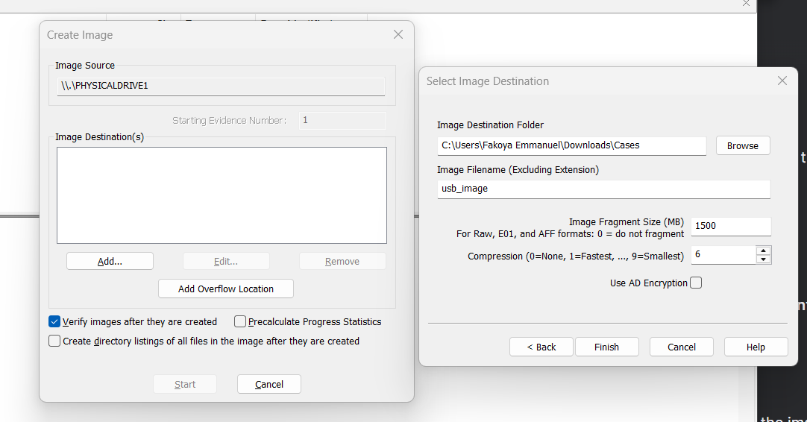

# Project: Windows Digital Forensics with FTK Imager & Autopsy

## Overview
This project demonstrates a comprehensive digital forensics investigation workflow on Windows using FTK Imager for evidence acquisition and Autopsy for analysis. The implementation covers forensic imaging, evidence preservation, and detailed analysis of digital artifacts for investigative purposes.

---

## Organizational Application

### Importance to Companies
Digital forensics capabilities are essential for organizations to conduct internal investigations, respond to security incidents, and support legal proceedings. Proper evidence handling ensures compliance with regulatory requirements and maintains evidentiary integrity.

### Use Case Scenario
A company needs to investigate potential intellectual property theft involving unauthorized file transfers to external USB devices. The forensic process includes:
- Creating forensic images of suspect storage devices
- Analyzing file metadata and transfer patterns
- Identifying unauthorized data exfiltration
- Generating court-admissible evidence reports
- Maintaining chain of custody documentation

### Compliance Benefits
- **Legal Preparedness**: Evidence collected following forensic standards
- **Incident Response**: Rapid investigation of security breaches
- **Data Protection**: Identification of sensitive data exposure
- **Regulatory Compliance**: Meeting data investigation requirements

---

## Configuration & Screenshots

### 1. FTK Imager Setup
- Launched FTK Imager 4.7.3.81 forensic tool
- Configured evidence acquisition settings
- Prepared for forensic image creation


*FTK Imager forensic tool interface and configuration*

### 2. Diskpart Evidence Protection
- Used Windows Diskpart utility to set read-only attribute
- Protected evidence from accidental modification
- Ensured evidence integrity during acquisition


*Diskpart utility setting read-only protection on evidence drive*

### 3. Forensic Image Configuration
- Configured E01 image format for evidence preservation
- Set appropriate compression and fragmentation settings
- Defined evidence numbering and destination paths


*Forensic image creation settings and parameters*

### 4. Evidence Source Selection
- Selected physical drive as evidence source
- Configured multiple destination verification
- Set up progress monitoring and verification


*Evidence source selection and destination configuration*

### 5. Image Creation Process
- Executed forensic image acquisition
- Monitored progress and estimated completion time
- Maintained evidence integrity throughout process


*Live forensic imaging process with progress monitoring*

### 6. Autopsy Case Creation
- Configured new forensic case in Autopsy
- Set case metadata and storage locations
- Prepared for evidence analysis


*Autopsy forensic case creation and configuration*

### 7. Data Source Analysis
- Imported forensic image for analysis
- Conducted comprehensive file system examination
- Identified relevant files and artifacts


*Forensic data source analysis and file examination*

### 8. Evidence Examination
- Analyzed file metadata and timestamps
- Identified suspicious files and patterns
- Documented findings for investigation


*Detailed evidence examination and metadata analysis*

### 9. Sensitive Information Recovery
- Traced document creation to specific individual
- Identified document modification patterns and timestamps
- Recovered application version and template information
- Extracted unique document identifiers and revision history
- Extracted detailed file metadata including creation dates
- Identified document authors and modification history
- Analyzed Microsoft Office document properties
- Recovered application-specific metadata fields
- Extracted full text content from recovered documents
- Identified sensitive content categories (Top Secret, PII, Intellectual Property)


*Recovery of confidential business information and intellectual property*

### 10. Report Generation
- Configured comprehensive reporting modules
- Prepared multiple output formats (HTML, Excel)
- Set up evidence documentation and export


*Forensic report generation and configuration*

---

## Observations and Challenges

### Technical Challenges
- **Evidence Integrity**: Maintaining write protection during acquisition

### Forensic Considerations
- **Evidence Preservation**: Preventing evidence alteration during analysis
- **Documentation**: Comprehensive case notes and reporting requirements

### Operational Challenges
- **Resource Intensive**: High system requirements for forensic analysis
- **Storage Management**: Efficient evidence storage and archiving solutions
- **Tool Proficiency**: Required expertise in multiple forensic applications

---

## Reflections

### Technical Learnings
- **Evidence Analysis**: Developed skills in file system examination and artifact recovery
- **Data Recovery**: Enhanced abilities in metadata analysis and pattern recognition

### Investigative Insights
- **Evidence Correlation**: Learned to correlate multiple evidence sources effectively
- **Timeline Analysis**: Developed skills in temporal evidence analysis and reconstruction
- **Reporting Skills**: Enhanced forensic documentation and reporting capabilities

### Professional Development
- **Legal Awareness**: Understanding of evidence admissibility requirements and standards
- **Ethical Considerations**: Importance of impartial and thorough investigations
- **Quality Assurance**: Implementation of verification and validation processes
- **Continuous Learning**: Need for ongoing training in evolving digital forensics

---

## How to Reproduce

### Prerequisites
- Windows 10/11 forensic workstation
- FTK Imager 4.7.3+ installed
- Autopsy forensic browser installed
- Storage device for analysis
- Administrative privileges required

### Implementation Steps

1. **Evidence Protection**
```bash
# Launch Diskpart and set read-only protection
diskpart
list disk
select disk [number]
attributes disk set readonly
exit
```

2. **FTK Imager Acquisition**
```bash
# Launch FTK Imager and configure:
# - Select Physical Drive as source
# - Set E01 format with compression
# - Enable verification and hashing
# - Specify destination path
```

3. **Autopsy Case Setup**
```bash
# Launch Autopsy and create new case:
# - Set case name and metadata
# - Configure base directory
# - Define case type and parameters
```

4. **Evidence Import**
```bash
# Import forensic image with:
# - Specify image file path
# - Configure import settings
# - Enable automatic processing
```

5. **Analysis Execution**
```bash
# Perform comprehensive analysis including:
# - File system examination
# - Metadata extraction
# - Timeline analysis
# - Artifact correlation
```

6. **Report Configuration**
```bash
# Generate forensic reports with:
# - Multiple format options (HTML, Excel)
# - Comprehensive findings documentation
# - Evidence summary and conclusions
```
